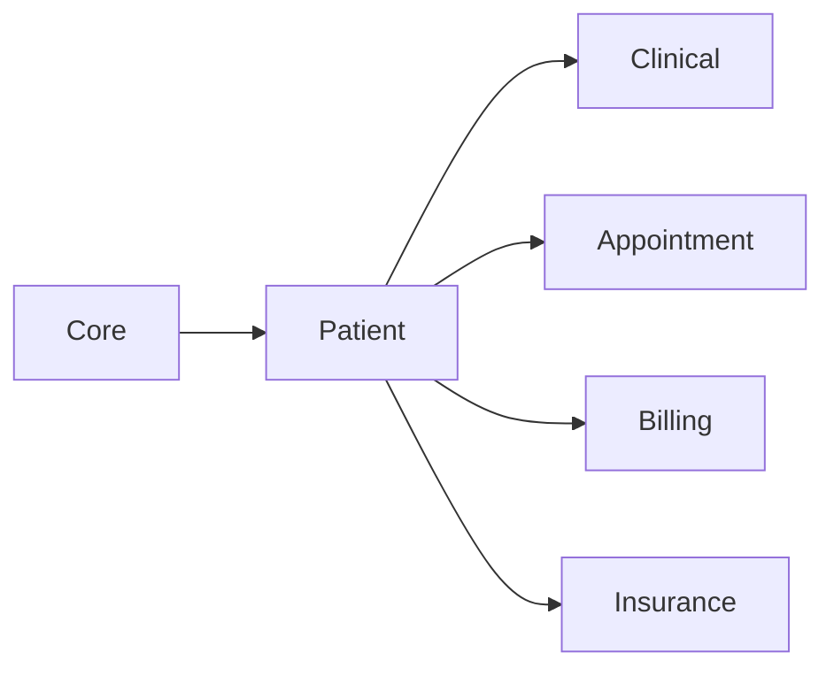

# Patient module

**In one sentence:** The Patient module is where the hospital creates and maintains **who the patient is**—legal name, demographics, contact details, official IDs (including **MRN**, Medical Record Number, and a global **UUID**), emergency contacts, and related records—so every other part of the system can point at one trusted person.

## Why this module exists

Before anyone can document a visit, order a test, or schedule an appointment, the facility must answer: **“Which human being is this?”** That sounds obvious, but in real hospitals patients arrive with many IDs (national ID, insurance number, passport), may share similar names, and need privacy for phone and email. This module is the **single place** that registers the patient and keeps identifiers consistent.

## Where Patient fits in FlowRise

- **Depends on Core** for organization and branch context (where the patient is registered) and shared platform services.
- **Clinical, Appointment, Billing, and Insurance** features all assume a `Patient` record exists when they record encounters, bookings, charges, or policies.

## What you can do with it (everyday language)

- **Register a new patient** with demographics and contact information.
- **Assign and manage identifiers** (MRN, NHIS or other insurance numbers, national ID, passport, custom IDs).
- **Maintain emergency contacts** (next of kin) for when the care team must reach someone quickly.
- **Search and open** a patient dossier from reception or clinical workflows.
- **Protect sensitive fields** (the system encrypts many personally identifiable fields at rest—think phone, email, and similar data).

Exact screens and click paths are described for staff in the [User guide: Patient management](../../docs/user-guide/patient-management.md).

## How it works (simple)

1. Staff use the **admin web app** (Filament) to open the patient area.
2. They fill registration or edit forms; validation runs so duplicate or invalid IDs are caught early.
3. The module’s **service layer** applies business rules (for example, how an MRN is generated or validated) instead of scattering logic across random screens.
4. Data is saved to the **patients** and related tables; other modules only reference the patient by stable IDs.

## What is inside this folder (high level)

| Path | Purpose |
|------|---------|
| `app/Models/` | `Patient`, identifiers, emergency contacts, schools, etc. |
| `app/Classes/Services/` | Registration, search, identifiers, schools—**the place business rules live**. |
| `app/Filament/` | Patient cluster, resources, forms, tables, and pages staff interact with. |
| `app/Policies/` | Fine-grained access (who may create or view a patient). |
| `app/Events/`, `app/Observers/` | Hooks when patients are created or updated (for integrations and side effects). |
| `database/migrations/` | Schema for patient-related tables. |

## Dependencies

- **Core** (`flowrise-hms/core` in `composer.json` / `module.json` `requires`).

Rollout status for all modules: [Module status](../../docs/shared/module-status.md).

## Further reading

- **Implementation plan (technical depth):** [docs/implementation-plan.md](docs/implementation-plan.md)
- **Staff-facing patient guide:** [Patient management](../../docs/user-guide/patient-management.md)

## For developers

- **Namespace:** `Modules\Patient\...`
- **Service provider:** `Modules\Patient\Providers\PatientServiceProvider`
- **Prefer services over ad hoc `Model::create()`** in new code so rules stay consistent with existing patterns.
- **Tests:** under `tests/`; run from repo root with paths pointing at `Modules/Patient/tests` as needed.
