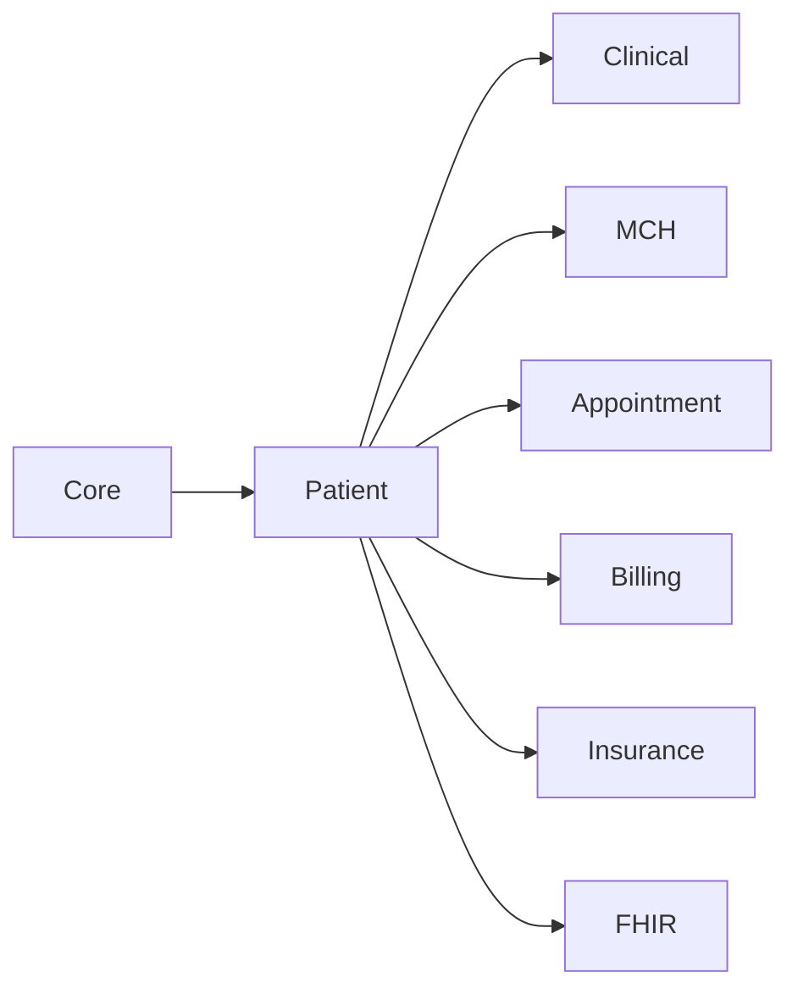

# Patient module

**In one sentence:** The Patient module is where the hospital creates and maintains **who the patient is**—legal name, demographics, contact details, official IDs (including **MRN**, Medical Record Number, and a global **UUID**), emergency contacts, and related records—so every other part of the system can point at one trusted person.

## Why this module exists

Before anyone can document a visit, order a test, or schedule an appointment, the facility must answer: **“Which human being is this?”** That sounds obvious, but in real hospitals patients arrive with many IDs (national ID, insurance number, passport), may share similar names, and need privacy for phone and email. This module is the **single place** that registers the patient and keeps identifiers consistent.

## Where Patient fits in FlowRise

- **Depends on Core** for organization and branch context (where the patient is registered) and shared platform services.
- **Clinical, MCH, Appointment, Billing, Insurance, Pharmacy, Diagnostics and FHIR** features all assume a `Patient` record exists when they record encounters, bookings, charges, policies, dispenses, results or exchange FHIR resources.

```mermaid
flowchart LR
  Core[Core]
  Patient[Patient]
  Clinical[Clinical]
  MCH[MCH]
  Appointment[Appointment]
  Billing[Billing]
  Insurance[Insurance]
  FHIR[FHIR]
  Core --> Patient
  Patient --> Clinical
  Patient --> MCH
  Patient --> Appointment
  Patient --> Billing
  Patient --> Insurance
  Patient --> FHIR
```

## What you can do with it (everyday language)

- **Register a new patient** with demographics, identifiers, insurance membership, school history, contact information and emergency contacts in a two-step wizard (**Patient Care → Patients → New patient**), or in-place from the Clinical / MCH workspaces.
- **Assign and manage identifiers** (auto-generated MRN, old hospital number, Ghana Card, passport, driver's licence, birth certificate, SSNIT, voter ID, alien ID, other). NHIS membership is recorded in the Insurance Information section supplied by the Insurance module.
- **Maintain emergency contacts** (next of kin) for when the care team must reach someone quickly.
- **Search and open** a patient dossier from reception or clinical workflows (global search, table search and filters) by name, MRN, old hospital number, or the full phone number, email or ID number (matched through blind indexes of the encrypted values; run `php artisan patients:rebuild-search-indexes` after importing data or rotating `APP_KEY`).
- **Upload documents** (PDF, images, Word) with preview/download through signed links.
- **Print a hospital card**, **import** patients from CSV, **export** (super admins) and **merge duplicate profiles**.
- **Protect sensitive fields** (phone, email, identifier values and emergency contact details are encrypted at rest).

Exact screens and click paths are described for staff in the [User guide: Patient management](../../docs/user-guide/patient-management.md).

## How it works (simple)

1. Staff use the **admin web app** (Filament) to open the patient area.
2. They fill registration or edit forms; validation runs so duplicate or invalid IDs are caught early.
3. The module’s **service layer** applies business rules (for example, how an MRN is generated or validated) instead of scattering logic across random screens.
4. Data is saved to the **patients** and related tables; other modules only reference the patient by stable IDs.

## What is inside this folder (high level)

| Path | Purpose |
|------|---------|
| `app/Models/` | `Patient`, `PatientIdentifier`, `EmergencyContact`, `PatientSchool`, `PatientRelationship` (mother/child), `PatientMerge`. |
| `app/Classes/Services/` | Registration, search, identifiers, emergency contacts, schools, merge, analytics—**the place business rules live**. |
| `app/Filament/` | Patient cluster and resource (wizard form, table, view with module-contributed tabs), `MergePatientAction`, importer/exporter, five dashboard widgets. |
| `app/Policies/` | Fine-grained access (who may create, view or merge a patient). |
| `app/Events/`, `app/Observers/` | `PatientRegistered/Updated/Deactivated/Deceased/PatientsMerged` events; observer that generates the MRN. |
| `app/Console/` | `patients:rebuild-search-indexes` (recomputes the phone/email/identifier blind indexes). |
| `app/Http/` | Hospital card PDF route, `GET /api/v1/patients` REST controller, FHIR `PatientTransformer`. |
| `database/migrations/` | 13 migrations for patient-related tables. |

## Dependencies

- **Core** (`flowrise-hms/core` in `composer.json` / `module.json` `requires`).

Rollout status for all modules: [Module status](../../docs/shared/module-status.md).

## Further reading

- **Implementation record (technical depth):** [docs/implementation-plan.md](docs/implementation-plan.md)
- **Staff-facing patient guide:** [Patient management](../../docs/user-guide/patient-management.md)

## For developers

- **Namespace:** `Modules\Patient\...`
- **Service provider:** `Modules\Patient\Providers\PatientServiceProvider`
- **Prefer services over ad hoc `Model::create()`** in new code so rules stay consistent with existing patterns.
- **Custom permissions:** `print_hospital_card`, `discharge_patient`, `view_patient_balance`, `import_patients`, `merge_patients`.
- **Extension points:** other modules add tabs with `RelationManagersRegistry`, header/bulk actions with `PageHeaderActionsRegistry` / `TableBulkActionsRegistry`, and merge handlers with `PatientMergeHandlersRegistry` (all in Core).
- **Tests:** `php artisan test --compact Modules/Patient/tests` (25 test files).
